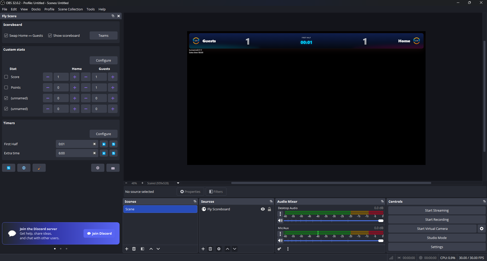

# Fly Scoreboard

Fly Scoreboard is an OBS Studio plugin for live scoreboard overlays. It provides a dock UI for teams, scores, match stats, timers, hotkeys, template loading, and local WebSocket control.

The default overlay is plain HTML/CSS/JavaScript. It receives live state from `ws://127.0.0.1:4457` and falls back to `plugin.json` when the socket is unavailable.

[Support on Ko-fi](https://ko-fi.com/mmltech)

## Highlights

- OBS dock for teams, logos, colors, scores, single stats, and timers.
- Score values are not capped at 999.
- Multiple score/stat rows with per-field visibility.
- Multiple timers with count-up/countdown modes and live overlay rendering.
- Hotkeys for score bumps, visibility toggles, side swapping, and timers.
- Swap-safe overlay data through `team_x`, `team_y`, and `fields_xy`.
- Local WebSocket remote control on `ws://127.0.0.1:4457`.
- Template folder picker in the dock.
- OBS locale files for English and Romanian UI text.
- Windows release archive uses OBS plugin layout.

## Preview

<p align="center">
  <picture>
    
  </picture>
</p>

## Install

Download the latest release from:

https://github.com/mmlTools/fly-scoreboard/releases

### Windows ZIP Layout

The Windows ZIP is packaged with this tree:

```text
fly-score/
  obs-plugins/
    64bit/
      fly-scoreboard.dll
  data/
    obs-plugins/
      fly-score/
        locale/
          en-US.ini
          ro-RO.ini
        overlay/
          index.html
          style.css
          script.js
          plugin.json
```

To install manually, copy the contents of `fly-score/` into your OBS Studio install folder, usually:

```text
C:\Program Files\obs-studio\
```

After restart, open the dock from OBS and select the Browser Source used by the overlay.

## Quick Start

1. Add a Browser Source in OBS.
2. Enable Local file and select the overlay `index.html`.
3. Open the Fly Scoreboard dock.
4. Select that Browser Source in the dock.
5. Configure teams, logos, colors, scores, single stats, and timers.
6. Toggle Show scoreboard and go live.

The default overlay expects `index.html`, `style.css`, `script.js`, and `plugin.json` to live in the same folder.

## Dock Features

### Teams

Set home/guest titles, subtitles, logos, and colors. The overlay runtime also exposes swap-safe teams:

- `team_x`: left-side team
- `team_y`: right-side team

When `swap_sides` is enabled, the runtime maps home/guest into the opposite visual positions automatically.

### Team Stats and Scores

Team stats are home/guest numeric pairs stored in `custom_fields[]`. The first row is the main score by default, but you can add rows for shots, saves, penalties, fouls, or any other numeric stat.

For templates, prefer the swap-safe view:

```html
<div>{{fields_xy[0].x}}</div>
<div>{{fields_xy[0].y}}</div>
```

Scores can be incremented through the dock, hotkeys, or WebSocket commands. They are clamped at zero but have no artificial 999 maximum.

### Single Stats

Single stats are one-value indicators such as `PERIOD`, `ROUND`, `SET`, or possession. Use:

```html
{{single_stats[0].label}} {{single_stats[0].value}}
```

### Timers

Timers support count-up and count-down modes. The overlay computes live values and exposes:

```html
{{timers[0].label}}
{{timers[0].mmss}}
```

Use `fs-if` to guard optional timers:

```html
<div fs-if="timers[1] && timers[1].visible">
  {{timers[1].label}} {{timers[1].mmss}}
</div>
```

## Templates

Use the Template row in the dock to choose a parent folder that contains template subfolders.

Example:

```text
My Templates/
  Soccer Lower Third/
    index.html
    style.css
    script.js
  Handball Compact/
    index.html
    style.css
    script.js
```

When you pick a template, the plugin points the selected Browser Source at that template's `index.html` and ensures a `plugin.json` state file exists there.

## Overlay Runtime

The default overlay runtime in `data/overlay/script.js` supports:

- `{{path.to.value}}` placeholders in text nodes and attributes.
- Array indexing like `{{fields_xy[0].x}}`.
- Attribute ternaries like `{{show_scoreboard ? 'hs-board' : 'hs-board is-hidden'}}`.
- Conditional rendering with `fs-if`.
- Live timer calculation from `remaining_ms`, `last_tick_ms`, `running`, and `mode`.
- WebSocket updates with polling fallback to `plugin.json`.

Supported `fs-if` operators:

- `!`
- `&&`
- `||`
- Parentheses

## WebSocket Remote Control

Connect to:

```text
ws://127.0.0.1:4457
```

Commands are JSON messages. Examples:

```json
{"type":"get_state"}
{"action":"bump_score","index":0,"side":"home","delta":1}
{"action":"set_score","index":0,"side":"away","value":12}
{"action":"timer_start","index":0}
{"action":"timer_pause","index":0}
{"action":"timer_reset","index":0}
{"action":"swap"}
{"action":"show_scoreboard","value":true}
{"action":"load_template","name":"Soccer Lower Third"}
```

The plugin broadcasts updated state after accepted changes.

## Localization

Plugin UI strings are loaded through OBS locale files:

```text
data/locale/en-US.ini
data/locale/ro-RO.ini
```

Most visible dock and dialog text is referenced by keys in code through `fly_i18n(...)`. Add or edit locale entries there when changing user-facing UI text.

## Build From Source

Requirements:

- CMake 3.28+
- Visual Studio 2022 on Windows
- OBS dependencies from `buildspec.json`
- Qt, provided by the OBS dependency setup used by the workflow

### Windows

```powershell
cmake --preset windows-x64
cmake --build --preset windows-x64 --config RelWithDebInfo
cmake --install build_x64 --config RelWithDebInfo --prefix release/RelWithDebInfo
```

The GitHub workflow uses:

```powershell
.github/scripts/Build-Windows.ps1 -Target x64 -Configuration RelWithDebInfo
.github/scripts/Package-Windows.ps1 -Target x64 -Configuration RelWithDebInfo
```

### macOS

```bash
cmake --preset macos
cmake --build --preset macos
cmake --install build_macos --config RelWithDebInfo --prefix release/RelWithDebInfo
```

### Ubuntu

```bash
cmake --preset ubuntu-x86_64
cmake --build --preset ubuntu-x86_64
cmake --install build_x86_64 --config RelWithDebInfo --prefix release/RelWithDebInfo
```

## Repository Layout

```text
data/
  locale/
    en-US.ini
    ro-RO.ini
  overlay/
    index.html
    style.css
    script.js
    plugin.json
docs/
  index.html
  pages/
installer/
  fly-scoreboard-installer.nsi
src/
  fly_score_dock.cpp
  fly_score_fields_dialog.cpp
  fly_score_hotkeys_dialog.cpp
  fly_score_logo_helpers.cpp
  fly_score_obs_helpers.cpp
  fly_score_paths.cpp
  fly_score_plugin.cpp
  fly_score_qt_helpers.cpp
  fly_score_state.cpp
  fly_score_teams_dialog.cpp
  fly_score_timers_dialog.cpp
  fly_score_websocket_server.cpp
  widget.cpp
  include/
```

## Useful Files

- `data/overlay/index.html`: default overlay markup.
- `data/overlay/style.css`: default overlay styling.
- `data/overlay/script.js`: template runtime and WebSocket client.
- `data/overlay/plugin.json`: default/fallback state.
- `data/locale/*.ini`: OBS locale strings.
- `.github/scripts/Package-Windows.ps1`: Windows ZIP staging and archive layout.

## Support

- Issues: https://github.com/mmlTools/fly-scoreboard/issues
- Documentation: https://mmlTools.github.io/fly-scoreboard/
- Ko-fi: https://ko-fi.com/mmltech
- PayPal: https://paypal.me/mmlTools

## License

MIT License. See `LICENSE`.
