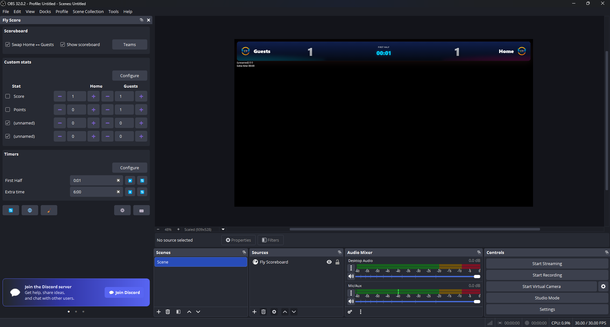

# Fly Scoreboard

Fly Scoreboard is an OBS Studio plugin for live scoreboard overlays. It provides a dock UI for teams, scores, match stats, timers, chapter-ready event logs, hotkeys, template-folder activation, and local WebSocket control.

The default overlay is plain HTML/CSS/JavaScript. It receives live state from `ws://127.0.0.1:4457` and falls back to `plugin.json` when the socket is unavailable.

[Support on Ko-fi](https://ko-fi.com/mmltech)

## Highlights

- OBS dock for teams, logos, colors, scores, single stats, and timers.
- Score values are not capped at 999.
- Multiple score/stat rows with per-field visibility.
- Multiple timers with count-up/countdown modes and live overlay rendering.
- Hotkeys for score bumps, visibility toggles, side swapping, and timers.
- Swap-safe overlay data through `team_x`, `team_y`, and `fields_xy`.
- Local WebSocket remote control on `ws://127.0.0.1:4457`.
- Automatic stream/recording event logs with relative or wall-clock timestamps.
- Template folder picker in the dock.
- Modular football overlay with separate scoreboard, fouls, cards, and corners HTML entry points.
- OBS locale files for English and Romanian UI text.
- Release artifacts use the native OBS plugin layout on Windows, macOS, and Linux.

## Preview

<p align="center">
  <picture>
    
  </picture>
</p>

## Install

Download the latest release from:

https://github.com/mmlTools/fly-scoreboard/releases

### Windows ZIP Layout

The Windows ZIP is packaged with this tree:

```text
fly-score/
  obs-plugins/
    64bit/
      fly-scoreboard.dll
  data/
    obs-plugins/
      fly-scoreboard/
        locale/
          en-US.ini
          ro-RO.ini
        templates/
          README.md
          Modular Football/
            index.html
            fouls.html
            cards.html
            corners.html
            style.css
            script.js
            plugin.json
```

To install manually, copy the contents of `fly-score/` into your OBS Studio install folder, usually:

```text
C:\Program Files\obs-studio\
```

On macOS, the plugin bundle belongs in `~/Library/Application Support/obs-studio/plugins/`. On Linux, packages use `lib/obs-plugins/` for `fly-scoreboard.so` and `share/obs/obs-plugins/fly-scoreboard/` for locales and templates.

The installed templates are read-only starter copies. Follow `templates/README.md` and copy the complete `Modular Football` folder to a writable per-user location before selecting it in the Fly dock. The plugin writes `plugin.json` and team-logo files there.

## Quick Start

1. Copy the included Modular Football template to the writable location recommended in `templates/README.md`.
2. Click **Template Folder...** in the Fly dock and choose that copied template directory.
3. Manually create a local-file Browser Source for `index.html` (scoreboard).
4. Add `fouls.html`, `cards.html`, and `corners.html` as separate Browser Sources when needed.
5. Resize, position, show, and hide every panel independently in OBS.
6. Configure teams, scores, fouls, cards, corners, and timers in the dock, then go live.

All module pages expect `style.css`, `script.js`, and `plugin.json` to live in the same folder.

## Dock Features

### Teams

Set home/guest titles, subtitles, logos, and colors. The overlay runtime also exposes swap-safe teams:

- `team_x`: left-side team
- `team_y`: right-side team

When `swap_sides` is enabled, the runtime maps home/guest into the opposite visual positions automatically.

### Team Stats and Scores

Team stats are home/guest numeric pairs stored in `custom_fields[]`. The first row is the main score by default, but you can add rows for shots, saves, penalties, fouls, or any other numeric stat.

For templates, prefer the swap-safe view:

```html
<div>{{fields_xy[0].x}}</div>
<div>{{fields_xy[0].y}}</div>
```

Scores can be incremented through the dock, hotkeys, or WebSocket commands. They are clamped at zero but have no artificial 999 maximum.

### Single Stats

Single stats are one-value indicators such as `PERIOD`, `ROUND`, `SET`, or possession. Use:

```html
{{single_stats[0].label}} {{single_stats[0].value}}
```

### Timers

Timers support count-up and count-down modes. The overlay computes live values and exposes:

```html
{{timers[0].label}}
{{timers[0].mmss}}
{{timers[0].hhmmss}}
```

Use `fs-if` to guard optional timers:

```html
<div fs-if="timers[1] && timers[1].visible">
  {{timers[1].label}} {{timers[1].mmss}}
</div>
```

## Modular overlays and templates

Click **Template Folder...** in the dock and choose one writable template directory directly. There is no Browser Source or template-selection combo box. OBS sources are created and managed only by the user.

Example:

```text
My Templates/
  Soccer Lower Third/
    manifest.ini
    index.html
    fouls.html
    cards.html
    corners.html
    style.css
    script.js
  Handball Compact/
    manifest.ini
    index.html
    style.css
    script.js
```

Each valid theme folder must contain `index.html` and `manifest.ini`. The manifest is an INI file because Qt can parse it directly and it is easy for users to edit:

```ini
title=Soccer Lower Third
author=Your Name
author_url=https://example.com
description=Compact lower-third scoreboard for soccer streams.
version=1.0.0
```

After a valid directory is chosen, the dock displays its manifest title as plain text, makes it the shared state/resources folder, and ensures a `plugin.json` file exists there. To switch setups, click **Template Folder...** again and choose another template directory.

The plugin does not create, select, rename, resize, or edit Browser Sources. Users manually load each desired HTML entry point into OBS. The pages synchronize because they consume the same WebSocket state and the same folder-local `plugin.json` fallback.

The bundled football package uses `index.html` for the scoreboard, `fouls.html` for fouls, `cards.html` for yellow/red cards, and `corners.html` for corners. Each is a completely separate OBS Browser Source.

## Event Logs

The **Events** tab records score/stat changes, timer starts and pauses, visibility changes, and manual notes. Starting an OBS stream or recording opens a new timestamp file automatically. Choose stream-relative timestamps for chapter markers or wall-clock timestamps for audit logs.

Logs are saved under the plugin configuration directory in `event-logs/`. Remote controllers can also send `start_event_log`, `log_event`, and `stop_event_log` commands.

## Overlay Runtime

The default overlay runtime in `data/overlay/script.js` supports:

- `{{path.to.value}}` placeholders in text nodes and attributes.
- Array indexing like `{{fields_xy[0].x}}`.
- Named football fields such as `{{fields_by_key.fouls.x}}` and `{{fields_by_key.corners.y}}`.
- Attribute ternaries like `{{show_scoreboard ? 'hs-board' : 'hs-board is-hidden'}}`.
- Conditional rendering with `fs-if`.
- Live timer calculation from `remaining_ms`, `last_tick_ms`, `running`, and `mode`.
- WebSocket updates with polling fallback to `plugin.json`.

Supported `fs-if` operators:

- `!`
- `&&`
- `||`
- Parentheses

## WebSocket Remote Control

Connect to:

```text
ws://127.0.0.1:4457
```

Commands are JSON messages. Examples:

```json
{"type":"get_state"}
{"action":"bump_score","index":0,"side":"home","delta":1}
{"action":"set_score","index":0,"side":"away","value":12}
{"action":"timer_start","index":0}
{"action":"timer_pause","index":0}
{"action":"timer_reset","index":0}
{"action":"swap"}
{"action":"show_scoreboard","value":true}
{"action":"log_event","label":"Shot on Goal"}
```

The plugin broadcasts updated state after accepted changes.

See the hosted [Tags & Developer Reference](https://fly-score.streamrsc.com/#developer-reference), [External Live Data](https://fly-score.streamrsc.com/#live-data), and [Event Logging](https://fly-score.streamrsc.com/#event-logging) guides for the full theme and integration workflow.

## Localization

Plugin UI strings are loaded through OBS locale files:

```text
data/locale/en-US.ini
data/locale/ro-RO.ini
```

Most visible dock and dialog text is referenced by keys in code through `fly_i18n(...)`. Add or edit locale entries there when changing user-facing UI text.

## Build From Source

Requirements:

- CMake 3.28+
- Visual Studio 2022 on Windows
- OBS dependencies from `buildspec.json`
- Qt, provided by the OBS dependency setup used by the workflow

### Windows

```powershell
cmake --preset windows-x64
cmake --build --preset windows-x64 --config RelWithDebInfo
cmake --install build_x64 --config RelWithDebInfo --prefix release/RelWithDebInfo
```

The GitHub workflow uses:

```powershell
.github/scripts/Build-Windows.ps1 -Target x64 -Configuration RelWithDebInfo
.github/scripts/Package-Windows.ps1 -Target x64 -Configuration RelWithDebInfo
```

### macOS

```bash
cmake --preset macos
cmake --build --preset macos
cmake --install build_macos --config RelWithDebInfo --prefix release/RelWithDebInfo
```

### Ubuntu

```bash
cmake --preset ubuntu-x86_64
cmake --build --preset ubuntu-x86_64
cmake --install build_x86_64 --config RelWithDebInfo --prefix release/RelWithDebInfo
```

## Repository Layout

```text
data/
  locale/
    en-US.ini
    ro-RO.ini
  overlay/
    index.html
    fouls.html
    cards.html
    corners.html
    manifest.ini
    style.css
    script.js
    plugin.json
docs/
  index.html
  pages/
installer/
  fly-scoreboard-installer.nsi
src/
  fly_score_dock.cpp
  fly_score_fields_dialog.cpp
  fly_score_hotkeys_dialog.cpp
  fly_score_logo_helpers.cpp
  fly_score_paths.cpp
  fly_score_plugin.cpp
  fly_score_qt_helpers.cpp
  fly_score_state.cpp
  fly_score_teams_dialog.cpp
  fly_score_timers_dialog.cpp
  fly_score_websocket_server.cpp
  widget.cpp
  include/
```

## Useful Files

- `data/overlay/index.html`: standalone football scoreboard panel.
- `data/overlay/fouls.html`: standalone fouls panel.
- `data/overlay/cards.html`: standalone yellow/red cards panel.
- `data/overlay/corners.html`: standalone corners panel.
- `data/overlay/manifest.ini`: default template metadata shown for the active folder.
- `data/overlay/style.css`: default overlay styling.
- `data/overlay/script.js`: template runtime and WebSocket client.
- `data/overlay/plugin.json`: default/fallback state.
- `data/websocket-sample.html`: browser-based sample remote for WebSocket control.
- `data/locale/*.ini`: OBS locale strings.
- `.github/scripts/Package-Windows.ps1`: Windows ZIP staging and archive layout.

## Local Windows build with Visual Studio 2026

Install CMake 4.2 or newer, then install the **Desktop development with C++** workload in Visual Studio Installer, including the MSVC v180 x64/x86 tools and a Windows 10 or Windows 11 SDK. Installing only the Visual Studio IDE is not sufficient.

You can add that workload from an elevated PowerShell terminal:

```powershell
$vsInstaller = "${env:ProgramFiles(x86)}\Microsoft Visual Studio\Installer\setup.exe"
$vsArguments = 'modify --installPath "C:\Program Files\Microsoft Visual Studio\18\Insiders" --add Microsoft.VisualStudio.Workload.NativeDesktop --includeRecommended --passive --norestart'
$vsProcess = Start-Process -FilePath $vsInstaller -ArgumentList $vsArguments -Verb RunAs -Wait -PassThru
$vsProcess.ExitCode
```

Accept the UAC prompt and wait for the elevated installer process. Exit code `0` means success; `3010` means success with a restart required. Exit code `5007` means the installer was not elevated and made no changes.

Configure and build with the dedicated VS 2026 preset:

```powershell
cmake --preset windows-vs2026-x64
cmake --build --preset windows-vs2026-x64
cmake --install build_vs2026_x64 --prefix release/RelWithDebInfo --config RelWithDebInfo
```

The VS 2026 preset uses `build_vs2026_x64/`. The `build_x64/` directory remains reserved for the VS 2022 preset used by GitHub Actions, preventing generator-cache conflicts.

## Support

- Issues: https://github.com/mmlTools/fly-scoreboard/issues
- Documentation: https://mmlTools.github.io/fly-scoreboard/
- Ko-fi: https://ko-fi.com/mmltech
- PayPal: https://paypal.me/mmlTools

## License

MIT License. See `LICENSE`.
